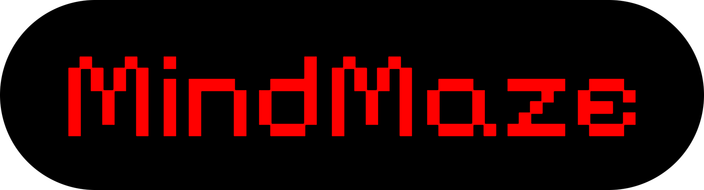

  

  

---

## 📖 Beschreibung
MindMaze ist ein Schulprojekt-Spiel, das die 3D-Map der Schule als Spielwelt nutzt.  
Spieler können die Schule erkunden und verschiedene Aufgaben und Herausforderungen meistern.

---

## ⚙️ Technologien
- HTML  
- CSS  
- JavaScript
- Node.js (für Server)

---

## 🚀 Features
- Erkunde die 3D-Schulwelt  
- Verschiedene Aufgaben und Mini-Puzzles  
- Menü- und GUI-System  
- Einfach erweiterbar  

---

## ✅ TODO

- [ ] Add Settings Sync

- [ ] Add Game Map

- [ ] Add Raycaster

- [ ] Add Multiplayer Support

- [ ] Add Leaderboard

---

## 📝 Lizenz

Keine Lizenz – alle Rechte vorbehalten.

--- 

## 👥 Autoren

SCP-4335-1, Sherma, BananaJoe und Noch 2 andera (nicht echte Namen)

## 🎨 Screenshots

### Logo

  

 ### Background

  
